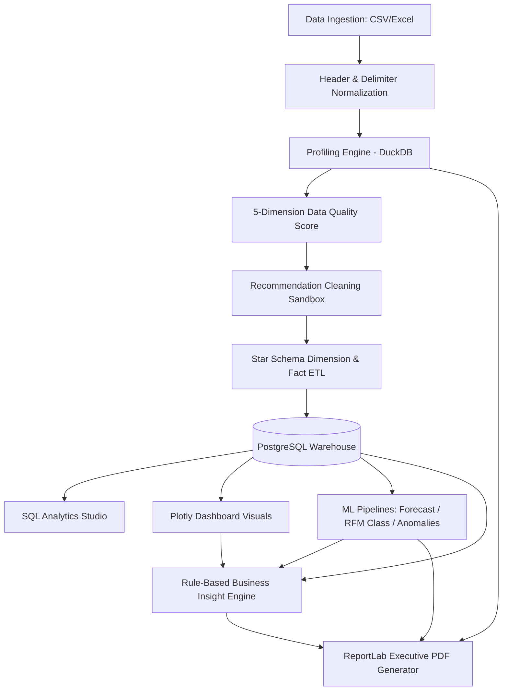

# InsightForge AI - Enterprise Data Warehouse & Analytics Platform

**InsightForge AI** is a production-grade, end-to-end data engineering and predictive analytics platform. It implements a clean, layered architecture designed to ingest raw transactional logs, profile data quality, execute recommendation-driven sanitization, establish a dimensional Star Schema in PostgreSQL, run custom SQL studio analytics, fit three machine learning models, and automatically generate executive PDF reports.

---

## 🛠️ Technology Stack
- **Backend API**: FastAPI (Python), SQLAlchemy (ORM), Uvicorn (ASGI)
- **Analytical Sandboxing**: DuckDB (in-memory analytics engine for 10x faster profiling)
- **Database**: PostgreSQL 15 (Enterprise Data Warehouse)
- **Frontend SPA**: React 19, TypeScript, Vite, Tailwind CSS v4, Plotly.js
- **Machine Learning**: Scikit-Learn (Ridge Regression, Random Forest, Isolation Forest)
- **Report Compiler**: ReportLab PDF Toolkit (custom canvas layouts & matplotlib chart injectors)
- **Infrastructure**: Docker, Docker Compose

---

## 📐 Architectural Flow & Data Lifecycle



---

## 💼 Core Engineering Capabilities

1. **Dataset-Agnostic Ingestion Engine**:
   Auto-detects delimiters (commas, semicolons, tabs), cleans raw headers to lowercase snake_case, infers data types, and loads data dynamically into PostgreSQL.
2. **Hybrid In-Memory Profiler (PostgreSQL + DuckDB)**:
   Pairs PostgreSQL persistence with an in-memory DuckDB sandbox, speeding up heavy calculations (Pearson correlations, quantiles, and histograms) by up to 10x.
3. **Data Quality Suite**:
   Evaluates datasets across 5 enterprise quality dimensions: **Completeness, Consistency, Validity, Uniqueness, and Accuracy** to calculate an Overall Quality Score.
4. **Recommendation-Driven Cleaning**:
   Calculates stats and suggests cleaning actions (standardizing dynamic dates, imputing null values with median/mode, dropping duplicates) with a preview sandboxed grid and transactional rollback.
5. **Star Schema ETL Pipeline**:
   Normalizes raw transactions into PostgreSQL star schema structures (`dim_customers`, `dim_products`, `dim_geography`, `dim_time`, and `fact_sales`) with proper foreign keys. Computes Customer RFM (Recency, Frequency, Monetary) analytics during dimensional load.
6. **SQL Analytics Studio**:
   Executes ad-hoc SQL queries against the star schema warehouse, rendering logs, execution times, paginated grids, and CSV exports.
7. **Multi-Model ML Pipelines**:
   - **Sales Forecasting**: Fits a Ridge Regression model on historical monthly sales using lagged features (`t-1`, `t-2`, `t-3`, `t-12`) to project future sales with 95% confidence intervals.
   - **High-Value Customer Classification**: Fits a Random Forest Classifier on RFM scores to predict high-value customer tiers, computing precision/recall/F1 metrics.
   - **Anomaly Detection**: Fits an Isolation Forest to flag discount and profit margin outliers.
8. **Executive Report Compiler**:
   Injects matplotlib visualizations, KPIs, data quality metrics, and rule-based insights directly into print-ready PDF briefs.

---

## ⚙️ Installation & Setup

Ensure you have [Docker Desktop](https://www.docker.com/) installed on your system.

### Option 1: Docker Compose (Quick Start)

1. Clone this repository:
   ```bash
   git clone https://github.com/vijayendravarma11/InsightForge-AI.git
   cd InsightForge-AI
   ```
2. Build and launch all services in daemon mode:
   ```bash
   docker compose up -d --build
   ```
3. Once running, access the following endpoints:
   - **Vite React Frontend (UI)**: [http://localhost:5175](http://localhost:5175)
   - **FastAPI API (Swagger UI)**: [http://localhost:8080/docs](http://localhost:8080/docs)
   - **PostgreSQL Database**: Host `localhost` | Port `5433` | User/Pass/DB `postgres`

### Option 2: Running Locally (Development Mode)

#### Backend Configuration
1. Navigate to the backend directory:
   ```bash
   cd backend
   ```
2. Create and activate virtual environment:
   ```bash
   python -m venv .venv
   source .venv/bin/activate  # Windows: .venv\Scripts\activate
   ```
3. Install packages:
   ```bash
   pip install -r requirements.txt
   ```
4. Start FastAPI server:
   ```bash
   uvicorn app.main:app --reload
   ```

#### Frontend Configuration
1. Navigate to the frontend directory:
   ```bash
   cd ../frontend
   ```
2. Install npm packages:
   ```bash
   npm install
   ```
3. Run Vite dev server:
   ```bash
   npm run dev
   ```
   Open [http://localhost:5175](http://localhost:5175) in your web browser.

---

## 🧪 Testing and Verification
Run the backend test suite inside the FastAPI container using:
```bash
docker compose exec backend env PYTHONPATH=. pytest
```
All unit tests should pass successfully.
